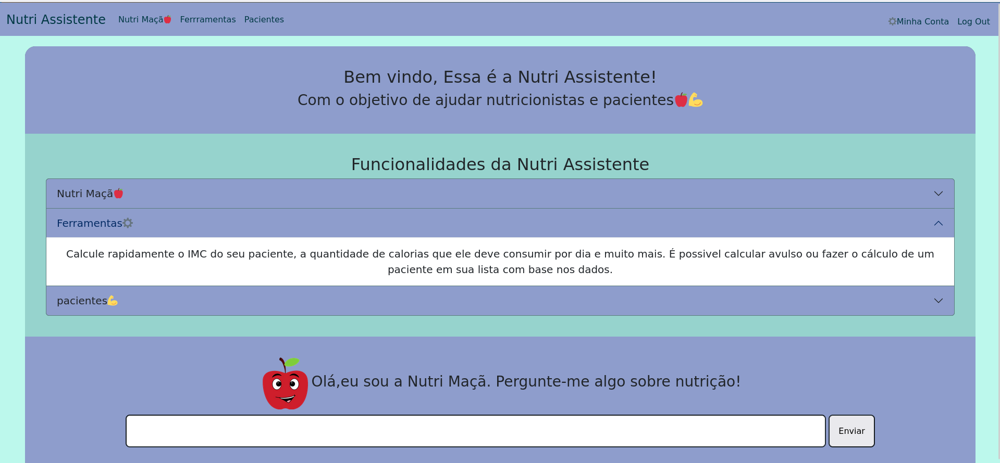
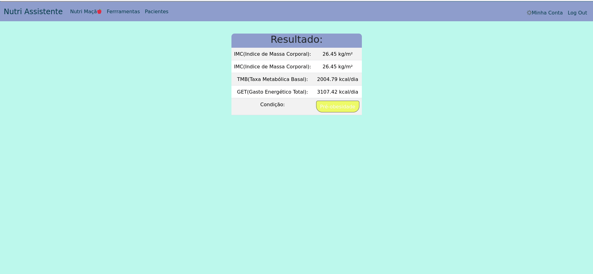
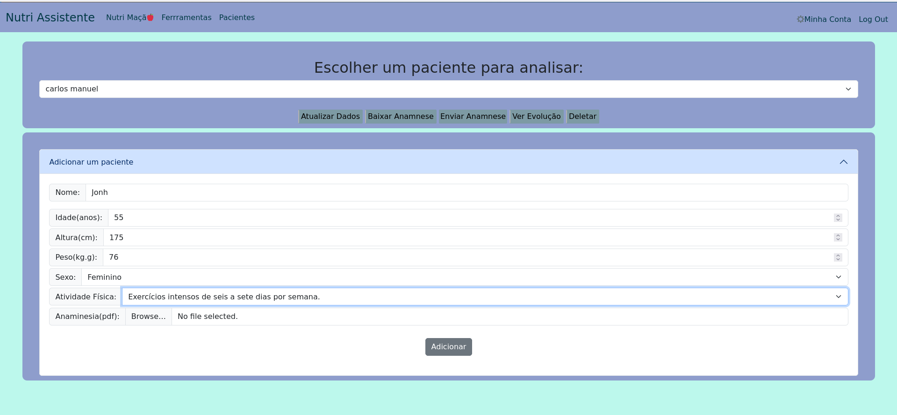
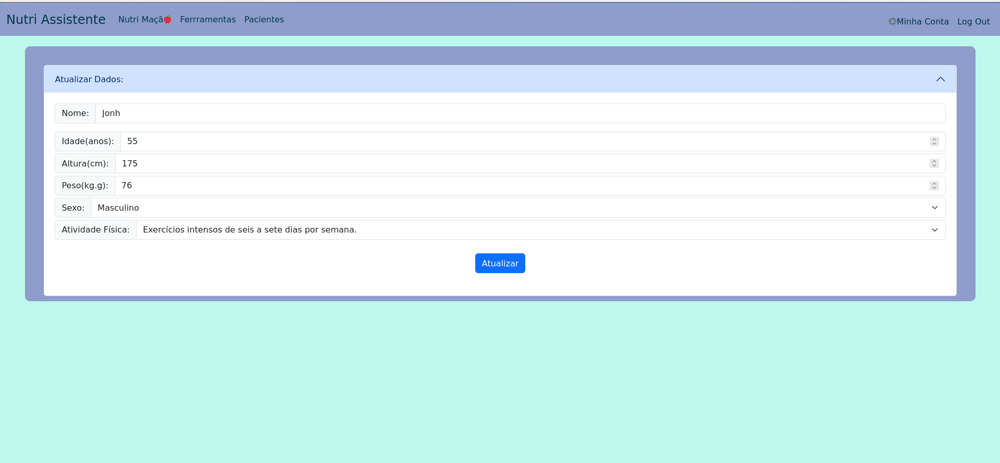
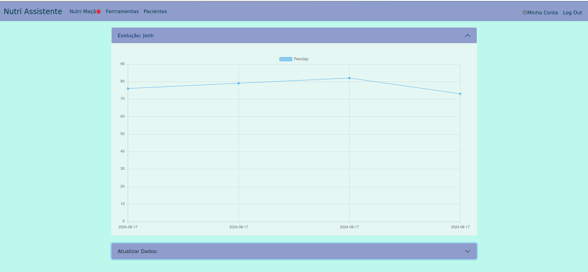
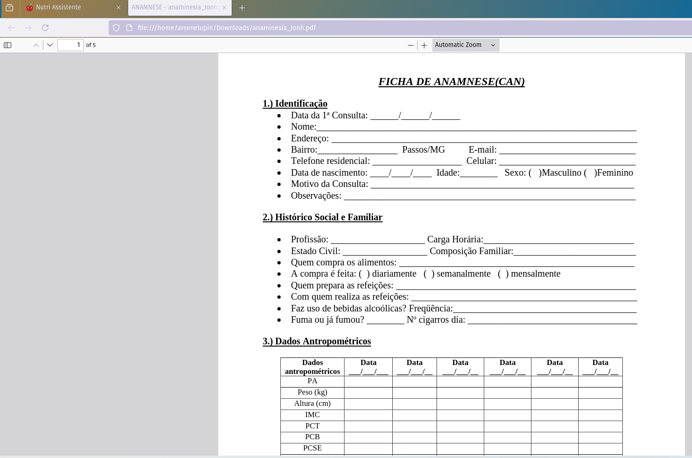
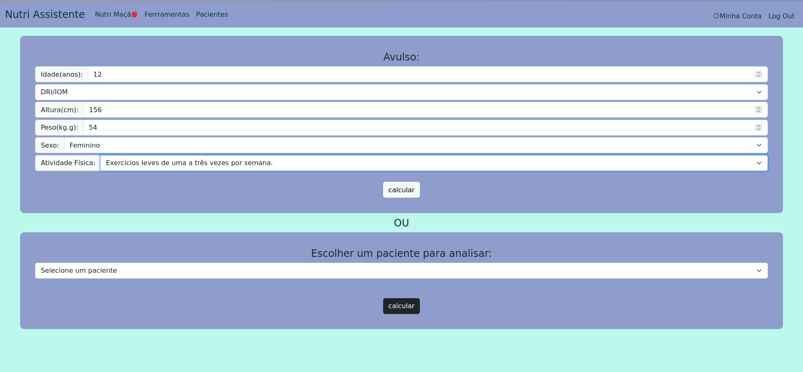

# Nutri Assistente - Projeto descontinuado devido a falta de um domínio

This site: http://nutriassistente.kesug.com is the cs50 final project.
A nutritionist told me that it was difficult to find a place where she could perform calculations and track the progress of her patients for free. That's why I decided to create a website that could perform these calculations (provided by the nutritionist) and allow for patient tracking.

## Table of Contents

-   [Tools](#tools)
-   [Usage](#usage)
-   [Screenshots](#screenshots)
-   [Contribution Request](#contributionrequest)
-   [License](#license)

## Tools

I used the Laravel framework to develop this site and some APIs to verify email (ZeroBounce) and Gemini API. However, because I'm using a free server that doesn't have API support, Gemini doesn't work.

## Usage

If you are a nutritionist, register with Nutri Assistente to obtain a nutritionist code. You can find this code on the "Your Account" page. As a nutritionist, you can create patients exclusively for yourself or share your code with a patient who will register to track their progress.

Else, you can track your body evolution and calculate your basal metabolic rate, total energy expenditure, see if you are overweight, etc.

## Screenshots

## License

This project is licensed under the [MIT License](LICENSE.md).
